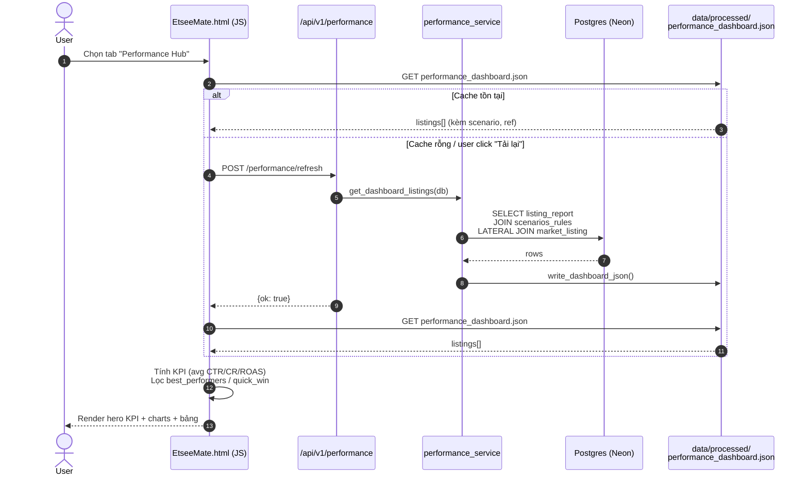

# Flow 01 — Performance Hub / Listing Performance

Feature: snapshot hiệu suất listing theo 3 chỉ số **CTR / CR / ROAS**.
UI pill: `perf-sub-performance`.

## Sequence flow



## Data flow (tầng dữ liệu)

```mermaid
flowchart LR
    subgraph DB[(Postgres)]
        LR[listing_report]
        SR[scenarios_rules]
        ML[market_listing]
    end

    LR -- "GROUP BY listing_id<br/>(latest period)" --> CTE[CTE 'lr']
    CTE -- "CTR / CR / ROAS bands" --> JOIN1{{JOIN}}
    SR --> JOIN1
    CTE --> LAT[LATERAL subquery]
    ML -- "product_type LIKE lr.product<br/>ORDER BY price*review_count" --> LAT
    JOIN1 --> OUT[rows: metrics + action + ref]
    LAT --> OUT
    OUT --> JSON[performance_dashboard.json]
    JSON --> FE[Frontend charts]
```

## Thành phần UI

| Phần | Tính toán | Nguồn |
|---|---|---|
| Hero CTR / CR / ROAS | `avg()` toàn bộ listing | JSON |
| Best Performers | `ctr ≥ 2% AND cr ≥ 4% AND roas ≥ 2` | JSON |
| Quick Win | `cr ≥ 4% AND ctr < 2%` | JSON |
| Chart gap | `metric - benchmark` theo product | JSON |
| Portfolio donut | count listing / product | JSON |

## Schema chạm tới

- `listing_report` — số liệu gốc (views, clicks, orders, revenue, spend, roas)
- `scenarios_rules` — gắn `action`/`case_name` cho từng listing
- `market_listing` — tìm reference competitor (title, shop_name)

## Đầu ra phía FE

Object JSON mỗi listing (rút gọn):
```json
{
  "listing_id": "1234567890",
  "title": "...",
  "product": "baby romper",
  "ctr": 2.1, "cr": 4.3, "roas": 2.8,
  "ctr_level": "high", "cr_level": "high", "roas_band": "profitable",
  "scenario_action": "keep",
  "scenario_label": "Có sales và đang lời",
  "ref_title": "...", "ref_shop": "..."
}
```
