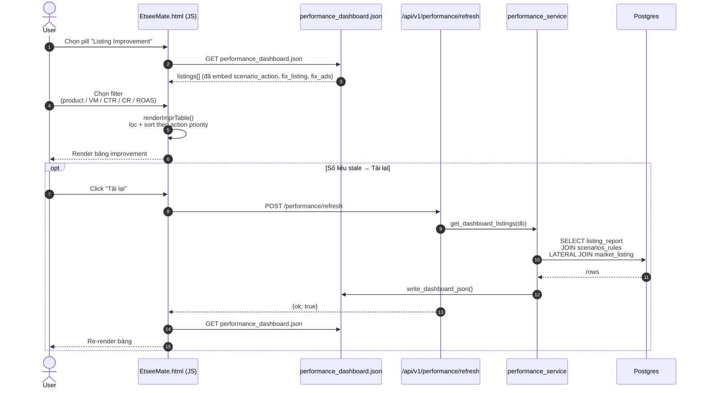
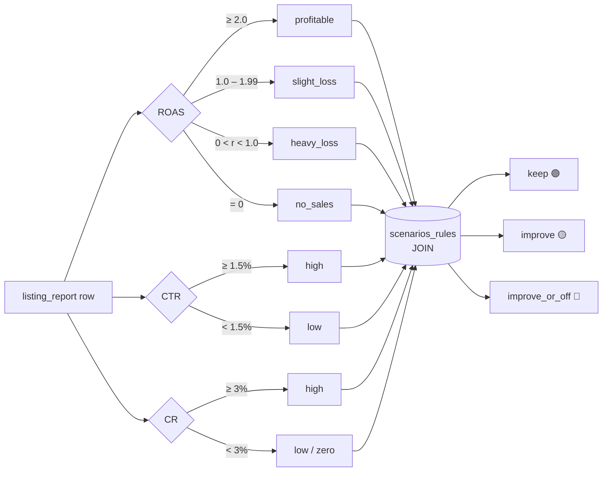
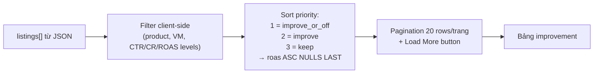

# Flow 02 — Listing Improvement

Feature: gợi ý hành động (`keep` / `improve` / `improve_or_off`) cho từng listing dựa trên ma trận `scenarios_rules`.
UI pill: `perf-sub-improvement`.

---

## Sequence flow

---

## Logic classification (band → scenario)

---

## Ma trận 14 kịch bản (seeded bởi `seed_scenarios()`)

| # | ROAS band | CR | CTR | Case | Action | Ưu tiên |
|---|---|---|---|---|---|---|
| 1 | profitable | high | high | Có sales và đang lời | **keep** | 3 |
| 2 | profitable | low | high | Có sales và đang lời | **improve** | 2 |
| 3 | profitable | high | low | Có sales và đang lời | **improve** | 2 |
| 4 | profitable | low | low | Có sales và đang lời | **improve** | 2 |
| 5 | slight_loss | high | high | Có sales, đang lỗ nhẹ | **improve** | 2 |
| 6 | slight_loss | high | low | Có sales, đang lỗ nhẹ | **improve** | 2 |
| 7 | slight_loss | low | high | Có sales, đang lỗ nhẹ | **improve** | 2 |
| 8 | slight_loss | low | low | Có sales, đang lỗ nhẹ | **improve** | 2 |
| 9 | heavy_loss | high | high | Có sales, lỗ nặng | **improve** | 2 |
| 10 | heavy_loss | low | high | Có sales, lỗ nặng | **improve** | 2 |
| 11 | heavy_loss | high | low | Có sales, lỗ nặng | **improve** | 2 |
| 12 | heavy_loss | low | low | Có sales, lỗ nặng | **improve_or_off** | 1 |
| 13 | no_sales | zero | high | Không có sale, có clicks | **improve_or_off** | 1 |
| 14 | no_sales | zero | low | Không có sale, có clicks | **improve_or_off** | 1 |

Ngưỡng: CTR ≥ **1.5%** = high · CR ≥ **3%** = high · ROAS break-even = **2.0**

---

## Gợi ý fix theo từng kịch bản đặc trưng

| Kịch bản | Cause tiêu biểu | Fix Listing | Fix Ads |
|---|---|---|---|
| `profitable` + CR low | Listing chưa đủ hấp dẫn, keywords ads chưa tối ưu | Kiểm tra giá, ship, review, hình chi tiết, options | Tắt keywords kém hiệu quả |
| `profitable` + CTR low | Hình main chưa đúng intent, giá mòi cao | Tối ưu keywords, hình main, alt, giá mòi | Tắt keywords không đúng intent |
| `slight_loss` bất kỳ | Views/clicks thấp hoặc AOV không cover ads spend | Sửa keywords long-tail, hình main, giá mòi | Tắt keywords rộng/cạnh tranh cao |
| `heavy_loss` + low/low | Listing chưa tối ưu; nếu đã tối ưu mà không cải thiện → tắt | Cùng như trên + kiểm tra review xấu | Tắt ads |
| `no_sales` + high clicks | Listing mới (theo dõi thêm) hoặc mất index | Đổi long-tail keywords, up ảnh chi tiết, xin reviews | Tắt keywords không liên quan |
| `no_sales` + low clicks | Listing mất index hoặc intent không khớp | Deactive → reactive lại listing + fix keywords | Tắt ads |

---

## Bảng improvement — cấu trúc cột UI

| Cột | Nguồn trường | Hiển thị |
|---|---|---|
| Listing title | `listing_report.title` | Link → Etsy URL |
| Product | derived từ `category` | Badge |
| VM | `listing_report.no_vm` | Text |
| CTR | Numeric | Badge xanh/vàng/đỏ |
| CR | Numeric | Badge xanh/vàng/đỏ |
| ROAS | Numeric | Badge theo band |
| Case | `scenarios_rules.case_name` | Text |
| Action | `scenarios_rules.action` | 🟢 keep / 🟡 improve / 🔴 improve_or_off |
| Cause | `scenarios_rules.cause` | Expand/tooltip |
| Fix Listing | `scenarios_rules.fix_listing` | Checklist expand |
| Fix Ads | `scenarios_rules.fix_ads` | Checklist expand |

---

## Sort & pagination

---

## Schema chạm tới

| Bảng | Vai trò |
|---|---|
| `listing_report` | CTR / CR / ROAS thực tế + metadata |
| `scenarios_rules` | 14-row matrix → action + cause + fix guide |
| `listings` | (optional) link Etsy, title chuẩn hoá |
