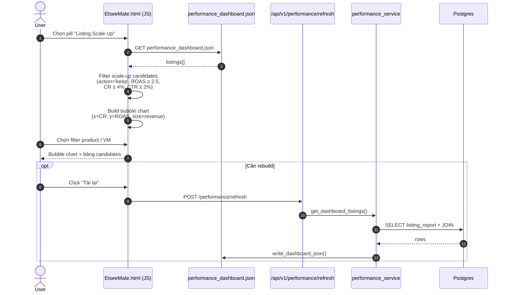
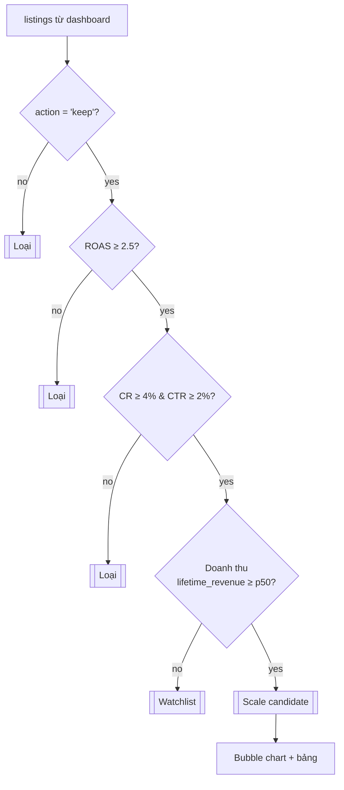
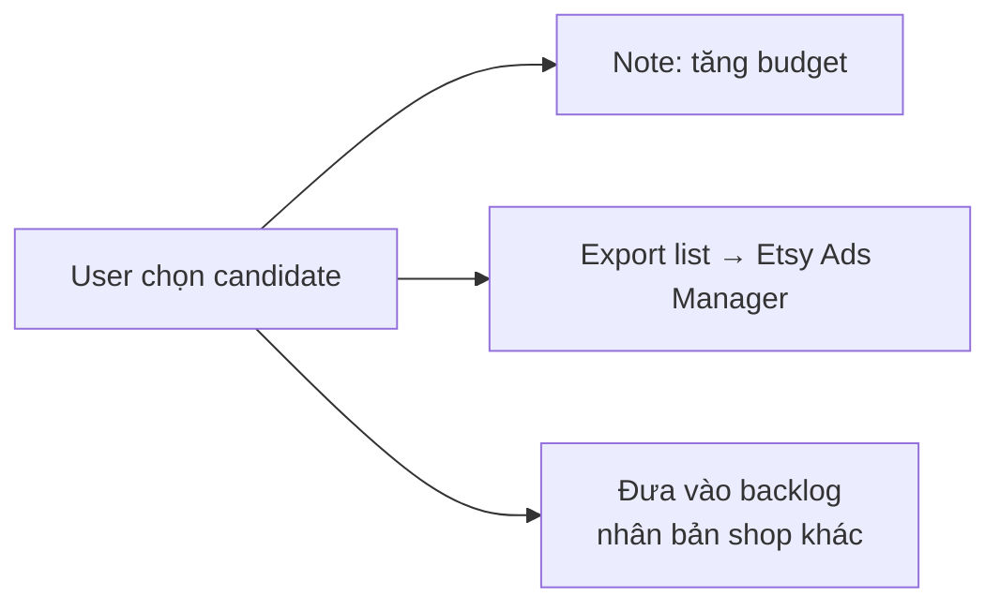

# Flow 03 — Listing Scale Up

Feature: xác định listing đang "bay" (CTR / CR / ROAS đều đạt ngưỡng) để đề xuất nâng ngân sách hoặc nhân rộng.
UI pill: `perf-sub-scaleup`.

## Sequence flow

## Logic chọn candidate

## Bubble chart mapping

| Trục | Giá trị | Giải thích |
|---|---|---|
| X | `cr` | Tỉ lệ convert |
| Y | `roas` | Lợi nhuận ads |
| Size | `revenue` (period gần nhất) | Độ lớn đóng góp doanh thu |
| Color | product group | Phân biệt baby romper / blanket / onesie |
| Label | `title` (rút gọn) + VM | Tooltip đầy đủ |

## Bảng candidates (cấu trúc cột)

| Cột | Nguồn |
|---|---|
| Listing | `listing_report.title` + link Etsy |
| Product | derived từ `category` |
| VM | `no_vm` |
| CTR / CR / ROAS | Numeric badge |
| Revenue (period) | `revenue` |
| Lifetime revenue | `lifetime_orders × price` hoặc `lifetime_revenue` |
| Reference market | `ref_title`, `ref_shop` từ LATERAL JOIN `market_listing` |
| Suggest action | "Tăng budget +30%" / "Nhân bản sang shop khác" |

## Schema chạm tới

- `listing_report` — metric gốc + lifetime
- `scenarios_rules` — chỉ lấy `action='keep'`
- `market_listing` — reference so sánh với top competitor

## Hành động sau khi chọn

