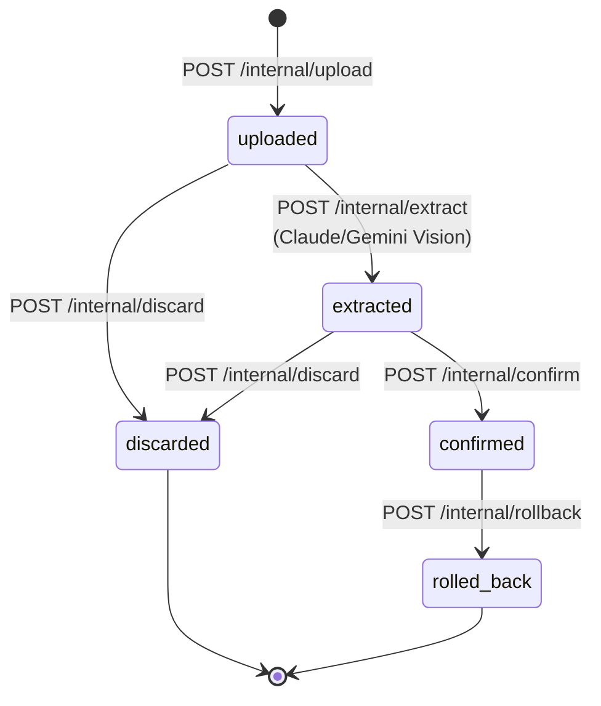
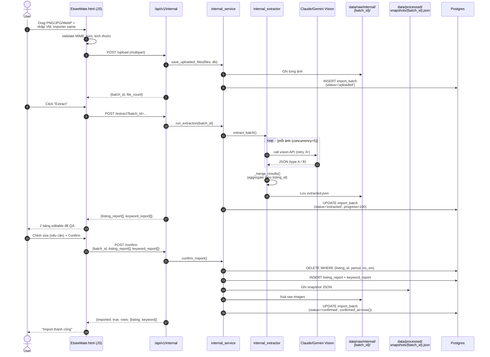
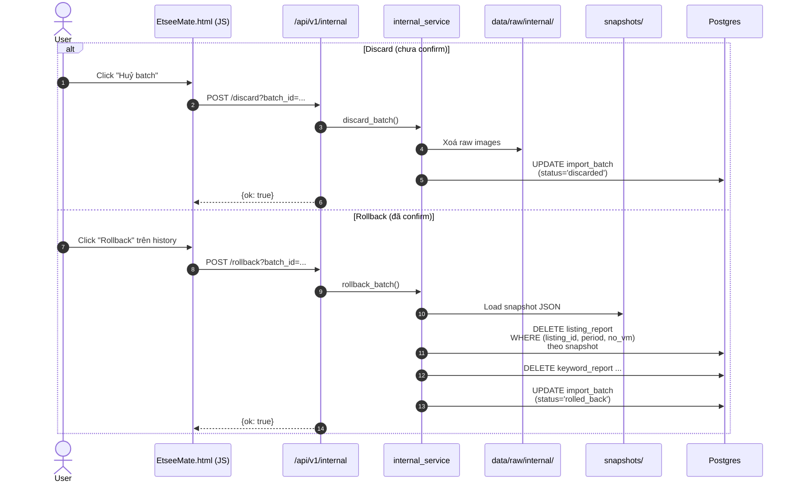

# Flow 04 — Internal Ads Import

Feature: chuyển screenshot báo cáo ads Etsy → DB (`listing_report` + `keyword_report`) qua 3 stage + 2 đường hồi phục.
UI pill: `perf-sub-import`.

## High-level state machine



## Sequence — happy path



## Sequence — discard / rollback



## Vision classification

```mermaid
flowchart LR
    Img[Ảnh screenshot] --> VIS[Claude/Gemini Vision]
    VIS --> CLS{Phân loại}
    CLS -->|Listing summary| A[Type A<br/>listing_id, title, price, stock,<br/>category, lifetime_*, metrics period]
    CLS -->|Keyword table| B[Type B<br/>keyword, roas, orders,<br/>spend, revenue, clicks,<br/>click_rate, views]
    A --> Merge[_merge_results<br/>aggregate by listing_id]
    B --> Merge
    Merge --> Preview[listing_report[] +<br/>keyword_report[]]
```

## Validation (stage upload)

| Check | Ngưỡng |
|---|---|
| MIME/magic bytes | `png` / `jpeg` / `webp` |
| File size | 10 KB ≤ size ≤ 20 MB |
| Kích thước ảnh | ≥ 200 × 200 px |
| VM code | không rỗng |
| Importer | không rỗng |

## Schema chạm tới

| Bảng | Vai trò |
|---|---|
| `import_batch` | state machine + progress |
| `listing_report` | ghi dữ liệu sau confirm, xoá khi rollback |
| `keyword_report` | ghi dữ liệu sau confirm, xoá khi rollback |

## File system paths

| Path | Lifecycle |
|---|---|
| `data/raw/internal/{batch_id}/*.png` | Tạo khi upload, xoá khi confirm/discard |
| `data/raw/internal/{batch_id}/extracted.json` | Tạo khi extract |
| `data/processed/snapshots/{batch_id}.json` | Tạo khi confirm (để rollback) |

## Khoá tự nhiên khi ghi DB

```
(listing_id, period, no_vm)  → xoá cũ, insert mới
```

Đảm bảo re-import cùng period không tạo bản ghi trùng.
