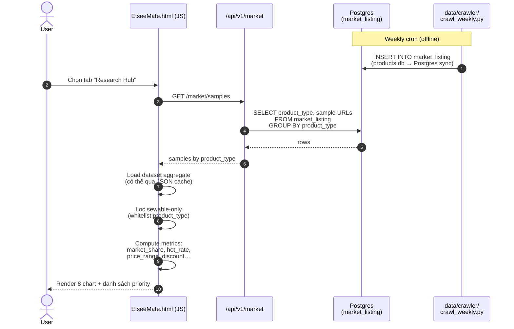
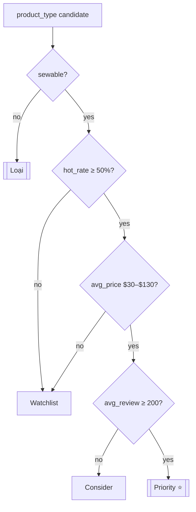

# Flow 05 — Research Hub (Market Trend Intelligence)

Feature: phân tích dữ liệu Etsy crawl để chọn sản phẩm **sewable** (may được) — ưu tiên hot rate, giá $30–$130, review ≥ 200.
UI tab: `tab-research`.

## Sequence flow



## Crawler pipeline (offline, chạy weekly)

```mermaid
flowchart LR
    URLS[data/crawler/<br/>search_urls.csv] --> CR[crawl_weekly.py]
    CR --> SHOT[screenshot_crawler<br/>(Playwright)]
    SHOT --> IMG[data/crawler/output/<br/>screenshots/*.png]
    IMG --> VA[vision_extractor<br/>(Gemini)]
    VA --> JSON[products.json / CSV]
    JSON --> SQLITE[data/crawler/output/<br/>products.db (SQLite)]
    SQLITE --> SYNC[save_postgres →<br/>market_listing]
    SYNC --> PG[(market_listing<br/>Postgres)]
```

## Dataset filter — "Sewable-only"

Whitelist áp dụng ở tầng FE (có thể server-side về sau):

| Cho phép | Loại |
|---|---|
| baby romper / onesie / bodysuit / sweater | ✅ |
| baby blanket / swaddle / keepsake album | ✅ |
| denim jacket / fabric bag / storage basket (fabric) | ✅ |
| plush toy (fabric) | ✅ |

Loại trừ: pottery, wood sign, ceramic, metal, electronics (không may được).

## 8 chart trong Research Hub

```mermaid
flowchart TB
    DS[market_listing<br/>(filtered sewable)] --> C1[chartMarketShare<br/>pie: listing / product]
    DS --> C2[chartListingCount<br/>bar: count]
    DS --> C3[chartHotRanking<br/>ranking by hot_rate]
    DS --> C4[chartHotRate<br/>% badge / total]
    DS --> C5[chartTagHotRate<br/>tag cloud]
    DS --> C6[chartPriceRange<br/>histogram price]
    DS --> C7[chartDiscount<br/>scatter: discount vs review]
    DS --> C8[chartEmerging +<br/>chartEstablished<br/>bubble new vs old]
```

## Priority scoring



## Schema chạm tới

| Bảng | Vai trò |
|---|---|
| `market_listing` | nguồn duy nhất cho Research Hub |

### Cột `market_listing` được dùng

| Cột | Dùng cho chart |
|---|---|
| `product_type`, `category` | Phân nhóm |
| `title` | Hiển thị top listing |
| `price`, `original_price`, `discount` | Price range / discount |
| `rating`, `review_count` | Emerging vs established |
| `badge`, `etsy_best`, `is_ad` | Hot rate |
| `shop_name` | Liệt kê top shop |
| `crawled_at` | Xác định batch crawl nào mới nhất |
