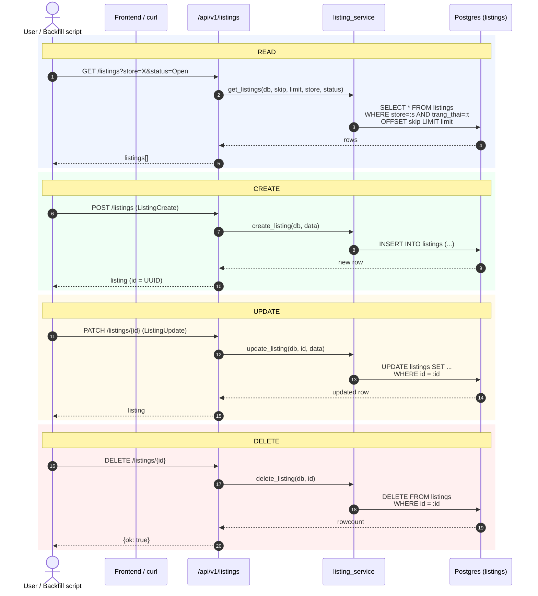
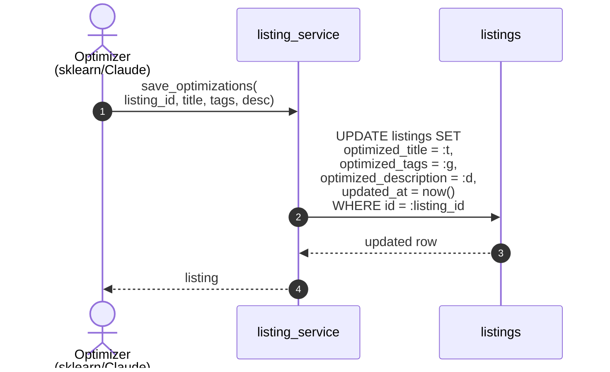

# Flow 06 — Listings CRUD

Feature: quản lý catalog nội bộ (`listings`) và lưu output AI optimization (`optimized_title` / `optimized_tags` / `optimized_description`).
UI: (chưa gắn vào EtseeMate.html — endpoint dùng cho backfill & Listing Manager tương lai).

## Sequence — các thao tác CRUD



## Sequence — AI optimization save



## Routes

| Method | Path | Handler | Schema |
|---|---|---|---|
| GET | `/api/v1/listings/` | `list_listings` | query: `skip`, `limit`, `store`, `status` |
| GET | `/api/v1/listings/{listing_id}` | `get_listing` |   |
| POST | `/api/v1/listings/` | `create_listing` | body: `ListingCreate` |
| PATCH | `/api/v1/listings/{listing_id}` | `update_listing` | body: `ListingUpdate` |
| DELETE | `/api/v1/listings/{listing_id}` | `delete_listing` |   |
| GET | `/api/v1/listings/stats/count` | `listing_count` |   |

## Quan hệ với các feature khác

```mermaid
flowchart LR
    L[listings] -- "listing_id (logical)" --> LR[listing_report]
    L -- "listing_id (logical)" --> KR[keyword_report]
    L -- "input cho AI optimize" --> OPT[Optimizer<br/>(sklearn/Claude)]
    OPT -- "save_optimizations()" --> L
    CSV[data/raw/<br/>production_file_listing.csv] -- "seed ban đầu" --> L
```

## Schema chạm tới

- `listings` — bảng duy nhất
- (logical) `listing_report` / `keyword_report` — đọc/ghi qua feature khác, không thuộc CRUD này

## Ghi chú vận hành

- `id` là UUID v4, sinh ở tầng model (`default=lambda: str(uuid.uuid4())`).
- Index: `idea_sku`, `store`, `trang_thai` — đảm bảo query filter bằng 3 cột này nhanh.
- `updated_at` tự cập nhật qua `onupdate=func.now()`.
- Khi gọi `save_optimizations`, không ghi đè trường gốc (`title`, `tag`, `description`) — chỉ set các cột `optimized_*` để giữ reversible.
