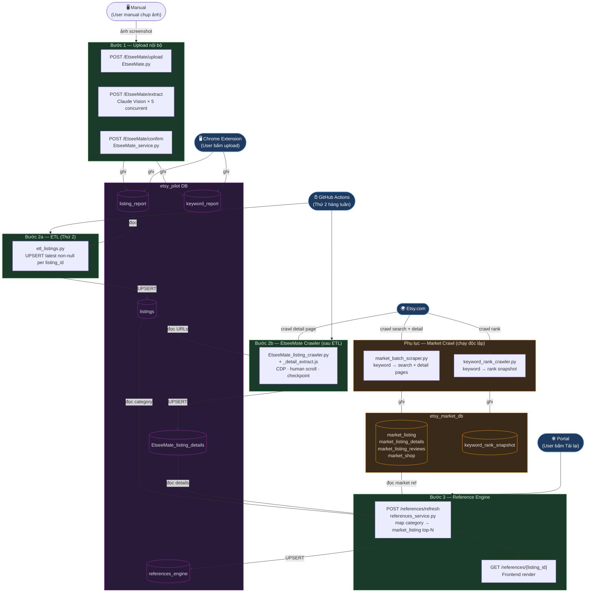

# Operation Workflow — Etsy Pilot

## Tổng quan luồng dữ liệu

> Render bằng VSCode extension **"Markdown Preview Mermaid Support"** hoặc paste vào [mermaid.live](https://mermaid.live)



---

## Bước 1 — Upload dữ liệu nội bộ (Extension)

**Trigger:** User bấm nút trên Chrome Extension → gửi ảnh screenshot màn hình Etsy Ads lên backend.

**Tool:** FastAPI endpoints tại `nguyenphamdieuhien.online/backend/app/api/routes/EtseeMate.py`
**Logic:** `nguyenphamdieuhien.online/backend/app/services/EtseeMate_service.py`

| Sub-bước | Endpoint | Ghi chú |
|---|---|---|
| Upload ảnh | `POST /api/v1/EtseeMate/upload` | Validate size (10KB–20MB), dimension ≥200×200, tạo `import_batch` |
| Extract | `POST /api/v1/EtseeMate/extract` | Claude Vision chạy song song (tối đa 5 ảnh), parse ra metrics |
| User review | *(trên Extension UI)* | User xem preview, chỉnh sửa nếu sai |
| Confirm | `POST /api/v1/EtseeMate/confirm` | Ghi vào DB, xóa ảnh raw |
| (Rollback nếu cần) | `POST /api/v1/EtseeMate/rollback` | Xóa rows theo `import_time`, giữ snapshot JSON |

**DB được ghi:**
- `etsy_pilot.listing_report` — metrics cấp listing (views, clicks, orders, revenue, spend, ROAS, price, stock, category)
- `etsy_pilot.keyword_report` — metrics cấp keyword (clicks, orders, spend, revenue, ROAS, relevant)

---

## Bước 2 — ETL + Crawl nội bộ (Tự động, Thứ 2 hàng tuần)

### 2a. ETL: tổng hợp `listing_report` → `listings`

**Trigger:** GitHub Actions cron, thứ 2 hàng tuần (Monday afternoon).

**Tool:** `nguyenphamdieuhien.online/data/crawler/etl_listings.py`

```bash
python3 etl_listings.py
```

**Logic:**
- Với mỗi `listing_id` trong `listing_report`, lấy giá trị non-null mới nhất của `title`, `category`, `no_vm`, `importer`
- UPSERT vào `listings` — chỉ fill các cột đang NULL, **không overwrite** giá trị đã có
- Tự động sinh `url = https://www.etsy.com/listing/{listing_id}`

**DB:**
- Đọc: `etsy_pilot.listing_report`
- Ghi: `etsy_pilot.listings` (unique per `listing_id`)

---

### 2b. Crawl chi tiết listing nội bộ

**Trigger:** Chạy ngay sau khi ETL 2a hoàn thành (cùng GitHub Actions job, hoặc tay nếu cần).

**Tool:** `etsy_star_engine/crawler/EtseeMate_listing_crawler.py`

```bash
# Automated toàn bộ (production)
python3 EtseeMate_listing_crawler.py --auto

# Test N listing đầu
python3 EtseeMate_listing_crawler.py --auto 5

# Resume nếu bị gián đoạn
python3 EtseeMate_listing_crawler.py --resume 20260504_120000
```

**Yêu cầu:** Chrome đang mở với CDP (`--remote-debugging-port=9222`). Script tự launch nếu chưa mở.

**JS Extractor:** `etsy_star_engine/crawler/_detail_extract.js` — inject vào browser để parse DOM.

**Logic:**
- Đọc toàn bộ rows từ `etsy_pilot.listings` (lấy `listing_id`, `url`)
- Với mỗi URL: navigate → scroll (human-like) → chạy JS extractor → parse price, shipping, shop info, reviews, badge
- Checkpoint tự động sau mỗi listing → resume được khi crash
- Delay 8–20s giữa các listing

**DB:**
- Đọc: `etsy_pilot.listings`
- Ghi: `etsy_pilot.EtseeMate_listing_details` (UPSERT theo `listing_id`)

**Fields lưu:** `base_price`, `sale_price`, `discount_percent`, `currency`, `materials`, `highlights`, `shipping_status`, `origin_ship_from`, `ship_time_max_days`, `us_shipping`, `return_policy`, `design`, `ai_summary`, `rating`, `review_count`, `badge`, `shop_name`, `owner_name`, `shop_location`, `join_year`, `total_sales`, `shop_rating`, `shop_badge`, `smooth_shipping`, `speedy_replies`

---

## Bước 3 — Tải lại báo cáo (User bấm "Tải lại" trên Portal)

**Trigger:** User bấm nút "Tải lại" trên giao diện web → gọi API refresh.

**Tool:** FastAPI endpoint tại `nguyenphamdieuhien.online/backend/app/api/routes/references.py`
**Logic:** `nguyenphamdieuhien.online/backend/app/services/references_service.py`

```
POST /api/v1/references/refresh?top_n=3
POST /api/v1/references/refresh?top_n=3&listing_id=4384550669   # refresh 1 listing cụ thể
```

**Logic:**
- Với mỗi listing trong `etsy_pilot.listings`, lấy `category`
- Map `category` → keyword (vd: `Onesie` → `onesie`, `Blankets` → `blanket`)
- Query `etsy_market_db.market_listing` lọc theo `product_type` / `search_tag` khớp keyword
- Rank theo `tag_ranking ASC`, lấy top-N
- UPSERT vào `etsy_pilot.references_engine`

**DB:**
- Đọc: `etsy_pilot.listings`, `etsy_market_db.market_listing`
- Ghi: `etsy_pilot.references_engine`

**FE đọc kết quả:**
```
GET /api/v1/references                        # tất cả
GET /api/v1/references/{listing_id}           # 1 listing
```

---

## Phụ lục — Market Crawl (Độc lập, chạy riêng)

Đây là luồng **song song**, crawl dữ liệu thị trường theo keyword — không phụ thuộc vào 3 bước trên.

**Tool:** `etsy_star_engine/crawler/market_batch_scraper.py`

```bash
python3 market_batch_scraper.py --auto
python3 market_batch_scraper.py --auto 10
python3 market_batch_scraper.py --resume 20260504_120000
```

**Keywords nguồn:** `nguyenphamdieuhien.online/data/crawler/vm01_keywords.json`

**DB được ghi (etsy_market_db):**
- `market_listing` — overview từ search results (price, rating, badge, rank)
- `market_listing_details` — chi tiết trang listing (materials, shipping, design)
- `market_listing_reviews` — reviews
- `market_shop` — thông tin shop

**Rank Tracking (riêng biệt):**

```bash
python3 etsy_star_engine/crawler/keyword_rank_crawler.py --auto
# hoặc suggest keyword từ LLM:
python3 etsy_star_engine/crawler/keyword_rank_crawler.py --product "custom baby onesie"
```

**DB được ghi:** `etsy_market_db.keyword_rank_snapshot`

---

## Bảng tóm tắt

| Bước | Tool / Script | Trigger | DB Đọc | DB Ghi |
|---|---|---|---|---|
| 1. Upload + Extract | `EtseeMate.py` + `EtseeMate_service.py` | Extension → API | `import_batch` | `listing_report`, `keyword_report` |
| 2a. ETL | `etl_listings.py` | GitHub Actions (Thứ 2) | `listing_report` | `listings` |
| 2b. Crawl nội bộ | `EtseeMate_listing_crawler.py` | Sau ETL | `listings` | `EtseeMate_listing_details` |
| 3. Tải lại báo cáo | `references.py` + `references_service.py` | User bấm Portal | `listings`, `market_listing` | `references_engine` |
| (Market crawl) | `market_batch_scraper.py` | Thủ công / cron | `vm01_keywords.json` | `market_listing*`, `market_shop` |
| (Rank tracking) | `keyword_rank_crawler.py` | Thủ công / cron | `keyword_report` | `keyword_rank_snapshot` |
