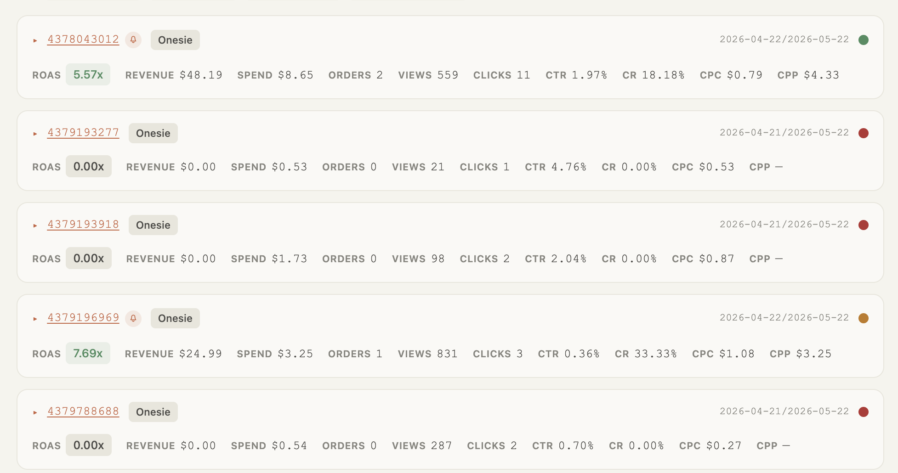
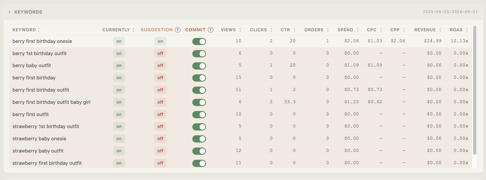
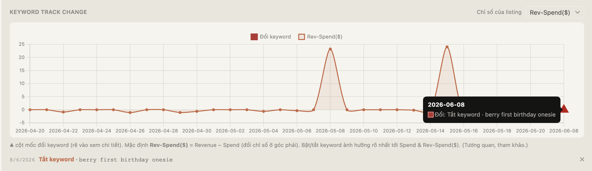

# Hướng dẫn sử dụng — GetifyCo Listing Portal

Tài liệu đi theo đúng **3 nhu cầu** của bạn. Mỗi nhu cầu trả lời 2 câu: **(1) Kết quả xem ở đâu → (2) Phải vận hành thế nào để ra kết quả đó.**

> Dữ liệu trong app đến từ **extension** quét trang Etsy Ads rồi ghi thẳng vào **Neon DB của bạn**. App không tự lấy dữ liệu — phải quét định kỳ (vd mỗi tuần). Không quét thì không có gì hiển thị.

---

## Nhu cầu 1 — Ghi nhận chỉ số ads của listing và keywords

**▸ Kết quả xem ở đâu**
- Tab **Action Recommendations** → khối **Performance**: mỗi listing 1 thẻ, các cột chỉ số **thẳng hàng** theo header chung — **ROAS · Revenue · Spend · Orders · Views · Clicks · CTR · CR · CPC · CPP**.
- Bung thẻ (▸) → bảng **Keywords**: chỉ số của **từng keyword** (Views/Clicks/CTR/Orders/Spend/CPC/CPP/Revenue/ROAS).
- Dropdown **Period** trên thanh công cụ: chọn 1 kỳ → số liệu overview của thẻ = **tổng (sum) của kỳ đó** (history & bảng keyword bên trong giữ nguyên).

**▸ Vận hành thế nào**
1. Cài extension (Firefox) → *Settings* của extension, dán **Database connection (Neon)** của bạn.
2. Mở trang **Etsy Ads** → extension quét → **Add to DB** (listing) và **Add Keywords to DB** (keyword).
3. Về app → tab **Action Recommendations** → **↻ Refresh** → các thẻ hiện chỉ số.

---

## Nhu cầu 2 — Đánh giá và đưa ra checklist tối ưu
> Đánh giá và đưa ra checklist tối ưu (tắt/mở listing, keywords hoặc tối ưu lại listing)
**▸ Kết quả xem ở đâu** — phần "đánh giá + việc cần làm" nằm ngay trong mỗi thẻ:
- **Chấm màu** cuối hàng tiêu đề thẻ = đánh giá listing: 🟢 giữ chạy (đang lời) · 🟠 cần cải thiện · 🔴 cải thiện / nên tắt (rê vào xem chữ).
- Cột **Suggestion** trong bảng Keywords = đề xuất **bật/tắt từng keyword**: `on` (từng ra doanh thu → giữ) / `off` (chưa từng ra doanh thu trong lịch sử của toàn bộ listing → nên tắt). So với cột **Currently** để biết keyword nào đang đốt tiền.
- **🔔 Chuông** trên thẻ = listing có keyword đang ON nhưng Suggestion OFF.
- Bung **Details** → **checklist tối ưu lại listing** dạng 3 ô: **Root Cause** (vì sao) · **Fix Listing** (sửa gì trên listing) · **Fix Ads** (tắt/sửa keyword nào trong ads).

**▸ Vận hành thế nào**
1. Sau khi có dữ liệu (Nhu cầu 1), nhìn **chấm màu** để biết listing nào cần xử lý trước (🔴 → 🟠).
2. Quyết định **tắt/mở keyword**: trong bảng Keywords, chỗ `Currently = on` mà `Suggestion = off` → là keyword nên tắt, hoặc ngược lại. Nếu user quyết định đồng ý tắt hoặc mở trên hệ thống của Etsy thì user bấm vào nút toggle COMMIT tương ứng (để ghi nhận lịch sử nhanh)
3. Quyết định **tối ưu lại listing**: bung **Details**, làm theo **Fix Listing / Fix Ads**.
4. Muốn đổi ngưỡng đánh giá lời/lỗ (ROAS/CTR/CR) → tab **Configure Thresholds**.

---

## Nhu cầu 3 — Ghi nhận đã thao tác gì, theo dõi đánh giá lại xem cách tối ưu có hiệu quả không

**▸ Kết quả xem ở đâu**
- **Ghi nhận thao tác**: cột **Commit** trong bảng Keywords — mỗi lần gạt (on ↔ off) ghi 1 mốc kèm thời gian vào lịch sử + cắm **cờ ▲** lên biểu đồ.
- **Theo dõi hiệu quả**: phần **Keyword Track change** trong thẻ — đường mặc định **Rev-Spend($) = Revenue − Spend** theo ngày (đổi chỉ số ở góc phải). User có thể tuỳ chọn chỉ số khác. 
- Trong chart **▲** là cột mốc thay đổi một Keywords nào đó (rê vào xem cụ thể). So đường biểu đồ **trước vs sau cờ** → biết thay đổi có tác động hay không.

**▸ Vận hành thế nào**
1. Khi quyết định tắt/mở 1 keyword → gạt nút **Commit** ở bảng Keywords (ghi mốc + cắm cờ ▲ tại ngày hôm đó).
2. Qua **Etsy** tắt/mở keyword đó **thật** (Commit chỉ ghi nhận quyết định, **không** tự thao tác trên Etsy).
3. **Tuần sau quét lại dữ liệu** → mở **Keyword Track change**, nhìn đường **Rev-Spend($)** quanh cờ ▲ để đánh giá: tắt/mở keyword đó có cải thiện lãi ròng không.

> Ví dụ: ngày **8/6** gạt Commit *"Tắt keyword berry first birthday onesie"* → cờ ▲ hiện tại 8/6. Tuần sau quét lại, so Rev-Spend($) trước/sau 8/6 để biết việc tắt có hiệu quả không.

---

## Lưu ý quan trọng
- Dữ liệu **không real-time** — chỉ đổi **sau mỗi lần quét** bằng extension.
- Tắt/mở trên Etsy → **tuần sau quét mới thấy** cột `Currently` đổi theo.
- **Commit không tự tắt ad trên Etsy** — chỉ ghi nhận quyết định + đo tác động.
- Tìm nhanh: ô **search** (ID/title) · lọc **Product / ROAS / VM** · **Period** · sắp xếp bằng **Sort** + ↑/↓.
